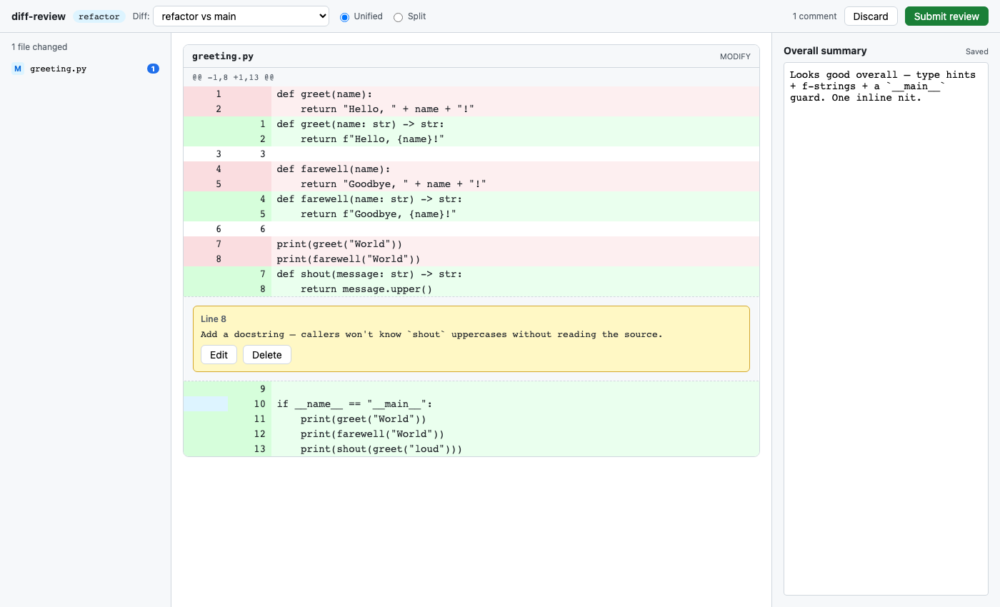

# diff-review

A Claude Code plugin that gives you a GitHub-style diff GUI for reviewing code from inside a CLI session.

Type `/diff-review:start` in a running Claude session → a browser tab opens with a clickable diff → leave per-line comments and an overall summary → click **Submit review** → your structured feedback is injected back into the conversation and Claude starts addressing it.



## Why

Reviewing Claude's edits in the terminal is awkward — scrolling diffs, typing comments inline, losing track of what you wanted to say. `diff-review` gives you the review surface you'd actually want: line / range selection, persistent drafts, branch-vs-base / individual-commit / unstaged toggles. Without leaving the CLI loop.

## Install

This is a Claude Code plugin. Installation is two steps: register the marketplace, then install the plugin.

### Prerequisites

- Claude Code (any recent version)
- Node 20 or newer on your `PATH` — the slash command shells out to `node` to run the bundled binary

### From a local clone

Useful for trying it before publishing, or for hacking on it.

```bash
git clone <this-repo-url> diff-review
cd diff-review

claude plugin marketplace add .
claude plugin install diff-review@diff-review-marketplace
```

That's it — `bin/diff-review.js` is pre-built and committed, so no `npm install` is needed to use the plugin.

### From a remote git repo

Once the repo is hosted on GitHub (or any git provider Claude Code can clone):

```bash
claude plugin marketplace add github:<owner>/<repo>
# or, for any git URL:
claude plugin marketplace add https://github.com/<owner>/<repo>.git

claude plugin install diff-review@diff-review-marketplace
```

### Verify

In a Claude Code session:

```
> /diff-review:start
```

should appear in the slash-command palette. Run it inside any git working tree to open the review UI.

### Update / uninstall

```bash
claude plugin update diff-review                       # refresh from marketplace
claude plugin marketplace update diff-review-marketplace
claude plugin uninstall diff-review               # remove the plugin
claude plugin marketplace remove diff-review-marketplace  # remove the marketplace
```

Persisted draft reviews live separately, under `~/.diff-review/` (see [Storage](#storage)) — uninstalling the plugin doesn't touch them.

## Usage

In any Claude session inside a git repository:

```
/diff-review:start
```

(`/diff-review` is accepted as a shorthand if no other matching command exists, but autocomplete will show the full `:start` form.)

A browser tab opens at `http://127.0.0.1:<port>`. Layout:

- **Top bar** — branch name, diff-source picker, unified/split toggle, comment count, **Discard** / **Submit review**
- **Left** — file tree with comment-count badges
- **Center** — the diff; clickable line gutters
- **Right** — optional overall-summary box

### Leaving comments

| Action | How |
|---|---|
| Comment on one line | Click that line's gutter (the number column) |
| Comment on a range | Click the first line's gutter, then **shift-click** the last line's gutter |
| Save | **Save** button or **⌘+Enter** in the textarea |
| Discard a draft you haven't saved | **Cancel** or **Esc** |
| Edit a saved comment | **Edit** on the thread |
| Delete a saved comment | **Delete** on the thread |

Comments save individually when you click **Save**. The overall-summary box auto-saves on blur (with a 1s debounce). All drafts persist to disk between browser refreshes and across CLI restarts.

### Switching diff sources

The dropdown lets you toggle between:

- `<branch> vs <base>` — committed changes (default)
- `<branch> vs <base> (incl. unstaged)` — layered with working-tree changes
- `Unstaged changes only` — just `git diff`
- Individual commits on the branch

Drafts persist across switches. If you have a comment anchored to a line that doesn't appear in the current source, the file panel shows `1 comment(s) from other diff sources — switch source to see them.`

### Expanding hidden context

Between hunks (or above/below them) you'll see an `↕ Expand N hidden lines` button. Click it to fetch and inline those lines from the old-side file at that diff source. Useful when you want to comment on a line that sits just outside `git diff`'s default 3-line context window.

### Submitting

Click **Submit review** → confirmation page → CLI binary exits with the markdown review on **stdout** → markdown gets injected back into the Claude conversation → Claude starts on the comments. Successfully-submitted drafts are cleared from disk.

### Cancelling

Click **Discard** (you get an inline confirm bar — no browser modal) or `Ctrl+C` the CLI. Drafts stay on disk; the next `/diff-review:start` invocation resumes where you left off.

## Output format

```markdown
# Code review feedback

## Overall

<summary text>

## Comments

### path/to/file.ts:42 (refactor vs main)

>     def shout(message: str) -> str:

<comment body>

### path/to/file.ts:101-118 (commit 593c4b8 — modernize greeting)

>     for item in items:
>         if item.kind == "x":
>             process(item)

<comment body>
```

Each heading carries the **diff source** so Claude knows which context the line numbers refer to (line 42 in `branch vs main` is not the same code as line 42 in a specific commit). The blockquote below the heading is the **actual line content** at save time — even if line numbers shift later, Claude can grep for the snippet.

Comments are sorted by file path, then by start line. The whole block — heading and all — is what Claude sees as user input.

## Architecture

```
.
├── .claude-plugin/
│   ├── plugin.json               # Plugin manifest
│   └── marketplace.json          # One-plugin marketplace so `claude plugin install` works
├── commands/start.md             # /diff-review:start slash command (executes the binary, captures stdout)
├── bin/diff-review.js            # Built artifact — single Node ESM file, ~240 KB, web UI inlined
├── src/
│   ├── cli/                      # Node http server, git wrappers, drafts I/O, output formatter
│   └── web/                      # React UI bundled into the binary at build time
├── pw/                           # Playwright browser tests
├── test/                         # node:test unit + integration tests
├── build.mjs                     # esbuild orchestration
└── scripts/screenshot.mjs        # Regenerate docs/screenshot.png
```

How a request flows:

```
Claude CLI session
  ⤷ /diff-review:start
       ⤷ commands/start.md (slash command)
            ⤷ node bin/diff-review.js  ←(blocks)
                 ⤷ Node http server on 127.0.0.1:<port>
                 ⤷ Opens default browser
                 ⤷ Loads bundled React UI (embedded HTML string)
                 ⤷ UI ↔ /api/{diff-sources,diff,drafts,summary,submit,cancel,events}
                 ⤷ On submit/cancel: writes markdown to stdout, exits
            ⤷ stdout captured by the slash command → fed back to Claude
       ⤷ Claude reads markdown → addresses comments
```

## Storage

Drafts live at `~/.diff-review/<repo-fingerprint>/drafts.json`. The fingerprint is `sha1(absolute path to .git dir)[:16]`, so worktrees of the same repo each get an independent store.

The directory also holds a `lock` file (PID of the running instance) — second invocation in the same repo gets a clean "already running" error. Stale locks from dead PIDs are auto-reaped on the next launch.

To reset everything:

```bash
rm -rf ~/.diff-review
```

## Security

- Server binds to `127.0.0.1` only — never `0.0.0.0`.
- Every API request requires a 32-byte random per-session token (in `?t=` or `X-Token`). Constant-time compared.
- All git operations use `child_process.execFile` with argument arrays — no shell interpolation.
- Single-instance lock per repo.

## Dependencies

Hard goal: minimize them.

**Runtime** (shipped):

- `react`, `react-dom` — UI framework
- `react-diff-view` — GitHub-style diff renderer with line interaction (pulls in `gitdiff-parser` as a transitive)

**Dev only:**

- `esbuild` — bundler (no Vite, no Babel, no Webpack)
- `typescript` — type checker (no emit step — esbuild does that)
- `tsx` — runs `*.ts` test files via `node --test`
- `@playwright/test` — real-browser end-to-end tests

**Standard library, deliberately not a 3rd-party dep:**

- `node:http` for the server (no Fastify/Express)
- `node:child_process` for git and browser launch (no `execa`, no `open`)
- `node:crypto` for tokens + repo fingerprinting
- `node:fs/promises` for drafts

## Development

```bash
npm install
npx playwright install chromium    # one-time: ~90 MB of test browser
npm run typecheck                  # tsc --noEmit
npm test                           # unit + browser tests
npm run build                      # rebuild bin/diff-review.js

# subset scripts
npm run test:unit                  # node:test only (fast — no browser)
npm run test:browser               # build + Playwright suite
node scripts/screenshot.mjs        # regenerate docs/screenshot.png
```

The build script (`build.mjs`):

1. `esbuild` bundles the React UI to `dist/web/{main.js,main.css}`
2. Inlines those into a single `dist/web/index.html`
3. Generates `src/cli/embedded.ts` with the HTML as a string literal
4. `esbuild` bundles the CLI from `src/cli/index.ts` into `bin/diff-review.js`

The shipped binary is one file, no `node_modules` required at runtime, Node 20+.

### CLI flags (mostly for testing)

```
diff-review [diff-source]

--cwd <path>     Run against this directory (default: $PWD)
--no-browser     Don't auto-open the browser; print the URL only
--port <n>       Bind to a specific port (default: random free port)
--auto-submit    Submit current drafts immediately and exit (test mode — no UI)
-h, --help       Show this help
```

## Troubleshooting

**Browser didn't open.** Most likely a non-default browser handler. Copy the `open http://127.0.0.1:...` URL from stderr and paste it manually. Or use `--no-browser` and skip the auto-open entirely.

**"another diff-review is already running (PID X)".** That PID is alive and holds the lock. Submit or discard in the other session, or kill the process. Stale locks (PID no longer alive) are reaped automatically.

**"not a git working tree".** Run inside a git repository, or pass `--cwd <path>` to a known one.

**"Could not determine default base branch".** The repo has no `origin/HEAD`, `main`, or `master` ref. Either set one (`git remote set-head origin --auto`) or use the "Unstaged changes only" / per-commit sources.

**Drafts seem lost / wrong file.** Worktrees of the same repo get independent stores (different `.git` dir = different fingerprint). Check `~/.diff-review/` — one directory per worktree. If you really want a clean slate: `rm -rf ~/.diff-review`.

**Port already in use.** Pass `--port <n>` to pick another, or let the default random-port behavior re-roll.

**The plugin commands list doesn't show `/diff-review`.** Confirm the marketplace registered (`claude plugin marketplace list`) and the plugin is installed (`claude plugin list`). If both look right but the slash command is absent, reinstall: `claude plugin uninstall diff-review && claude plugin install diff-review@diff-review-marketplace`. Validate the manifest with `claude plugin validate <path-to-clone>`.

## What's not in v1

- Verdicts (approve / request changes / comment only)
- GitHub-style "suggestion" code blocks
- Syntax highlighting in the diff (skipped to keep the bundle thin)
- Reviewing remote PRs from `gh pr` — this is local-only
- Multi-tab review on a single server

## License

MIT
